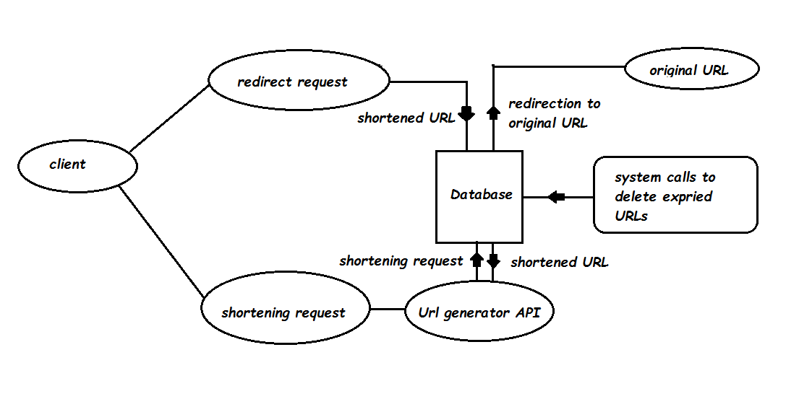

​
#LLD Document 

#System architecture

#Methods Involved

1. "ShortenURL"   
    * GenerateURL(URL)
    * SetURL(shortenedURL)

2. "ErrorRedirect"
    * returnErr()
      
3. "Redirect"
    * GetURL(shortenedURL)
    * Redirect(URL)

4. "RemoveExpiredData"
    * Collect_Data()
    * RemoveEntries()
​