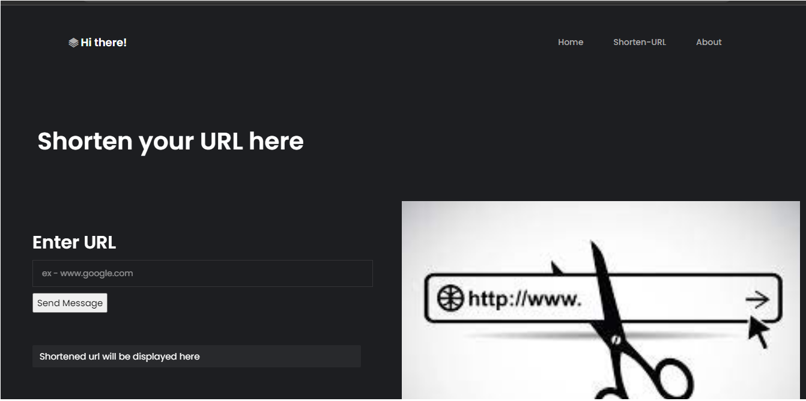
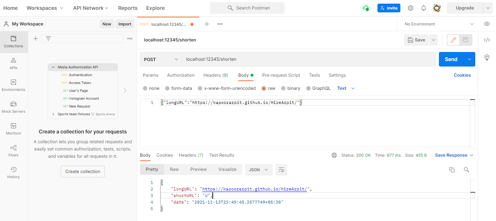

# Fast-URLshortener

# How this URL-shortener is different from others??
* This URL-shortener don't uses any hashing algorithms
* It is a clever tool that assigns serial numbers to long URLs and returns a Base100 value of the serial number.
* Here URLs are short and service is cost effective.
* URL also gets expired after 6 months.

# HLD design - https://github.com/kapoorarpit/Fast-URLshortener/blob/master/HLD.md
# LLD design - https://github.com/kapoorarpit/Fast-URLshortener/blob/master/LLD.md 

 
here is the backend API (displayed using postman service). 

